# 正则表达式

[中国大学mooc Python网络爬虫与信息提取](http://www.icourse163.org/course/BIT-1001870001)

<h3> 编译 </h3> 

将符合正则表达式语法的字符串转换成正则表达式特征

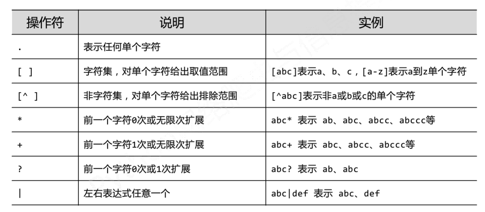

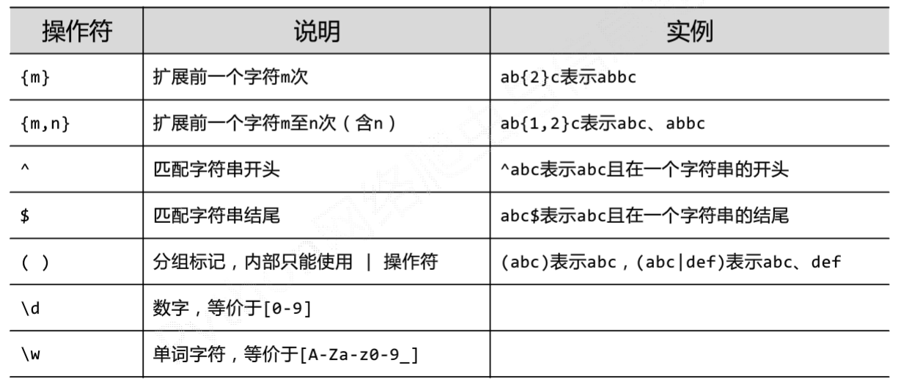

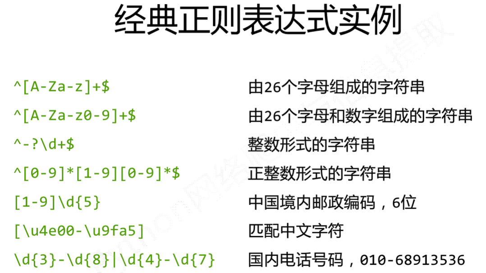

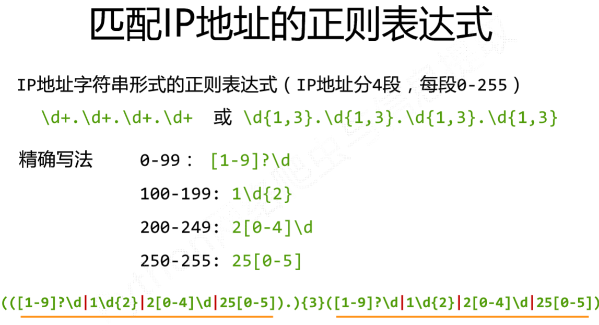

# re库 采用raw string类型(不将\当作转义符，string类型会当作，所以当字符串含转义字符用 raw string类型)表示正则表达式 表示为r'text'

中国大陆邮政编码r'[1-9]\d{5}'

国内电话号码r'\d{3}-\d{8}|\d{4}-\d{7}'

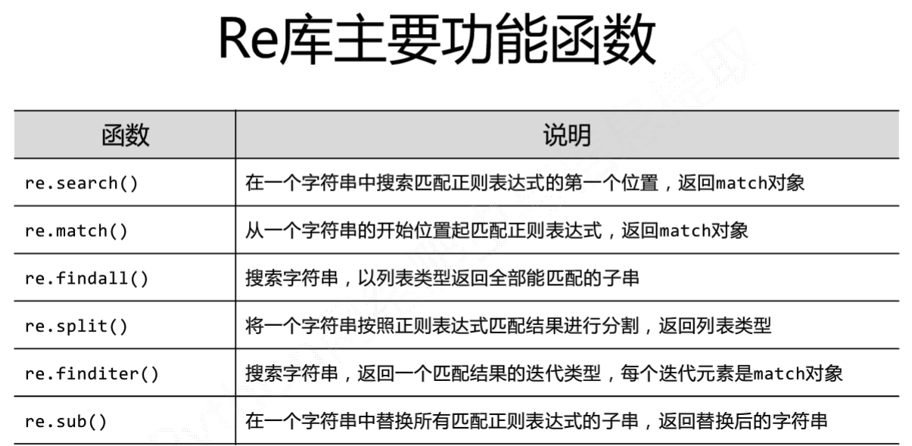

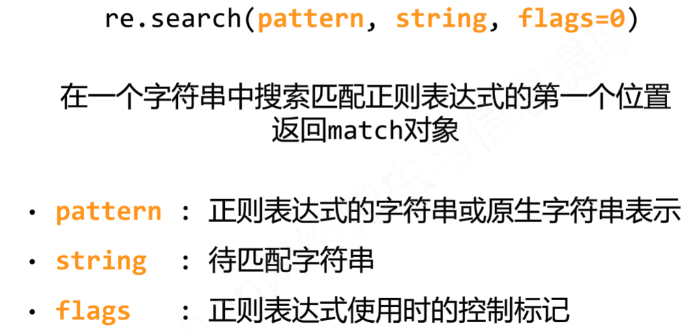

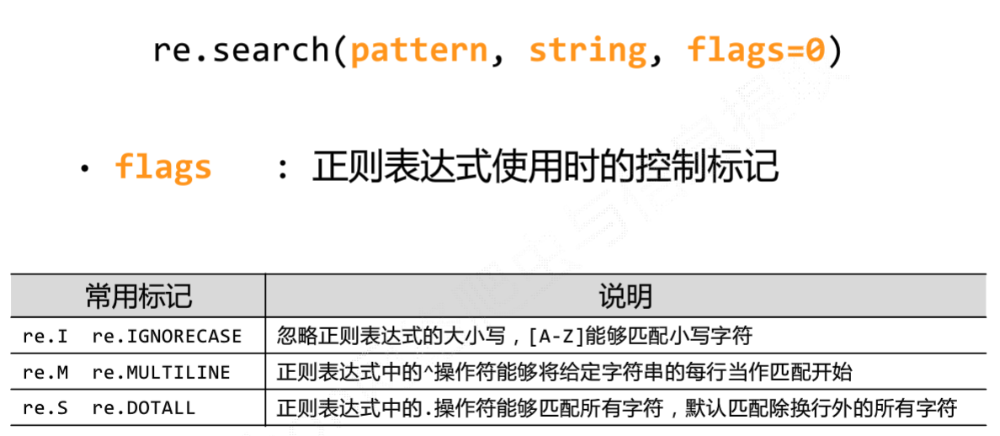

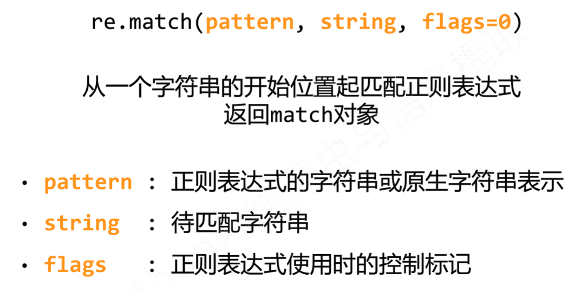

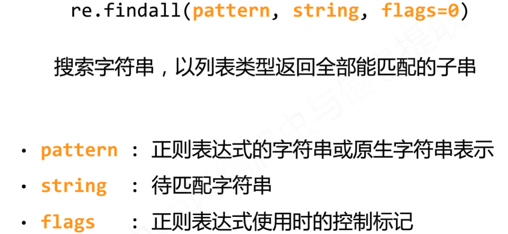

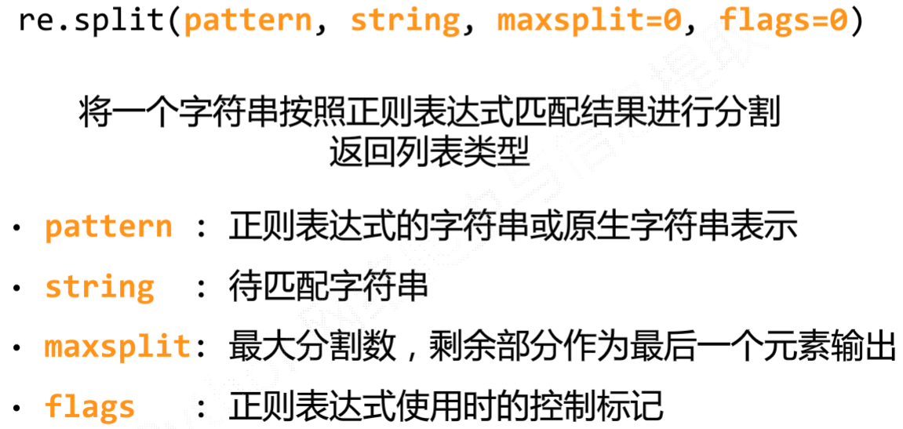

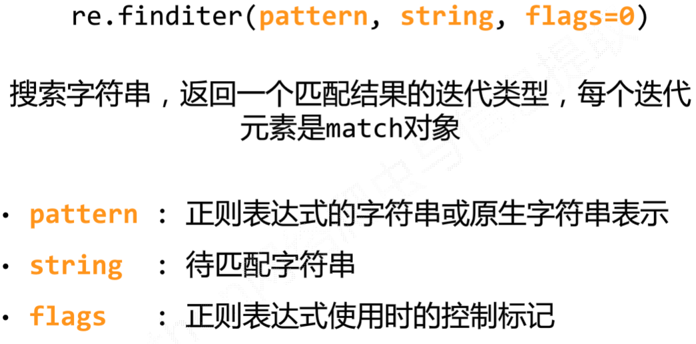

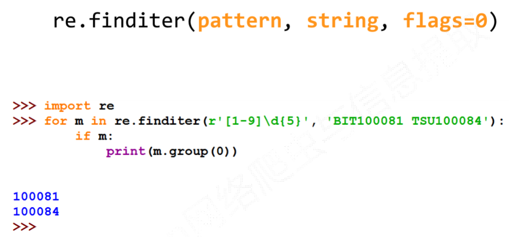

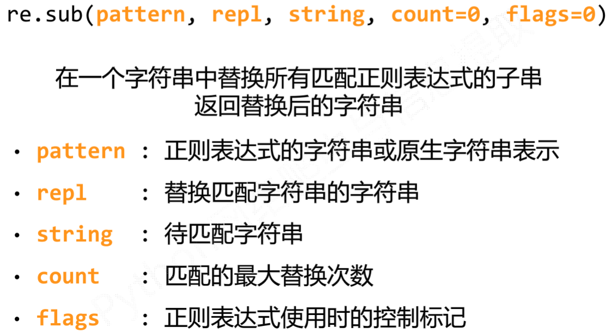

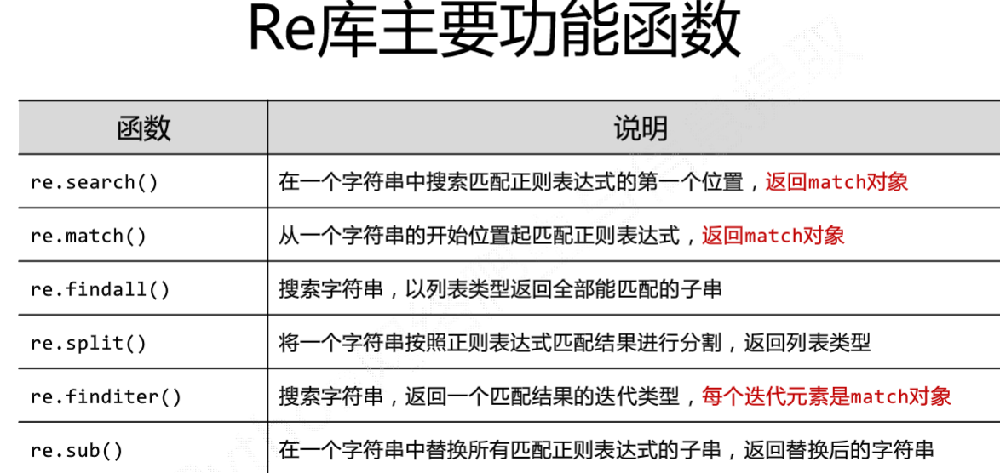

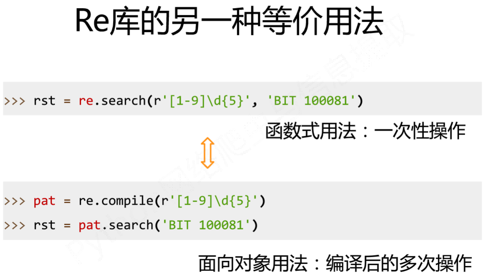

# regex=recompile(pattern,flags=0)   直接给出字符串即可，不需参数

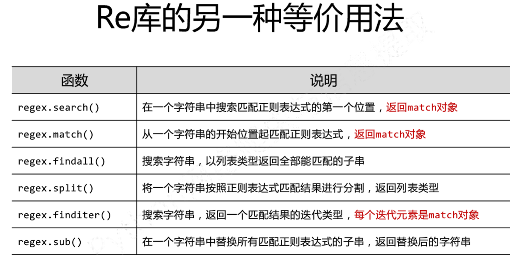

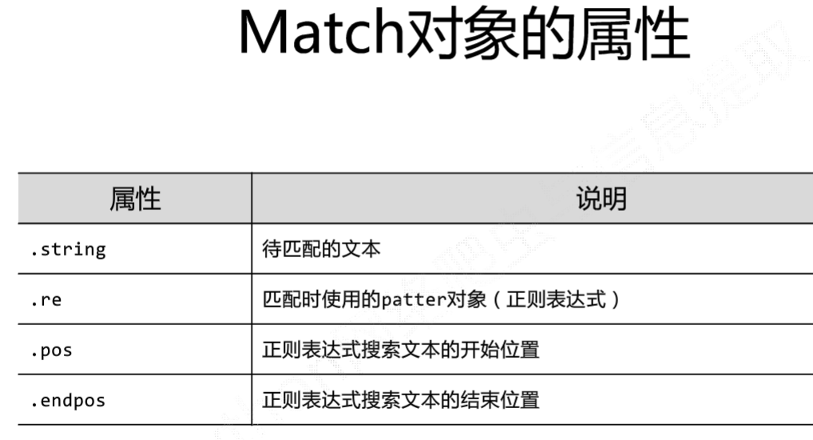

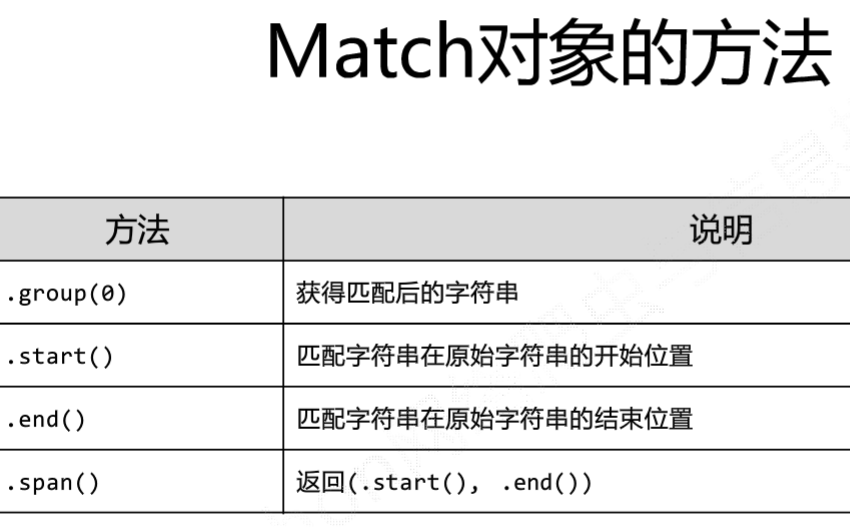

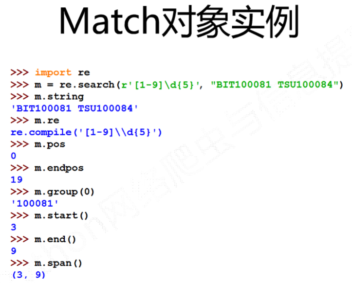

# match对象是一次匹配的结果，包含匹配 的很多信息

# re库默认贪婪匹配，即最长的字符串

# 那么如何最小匹配，输出最小d子串？

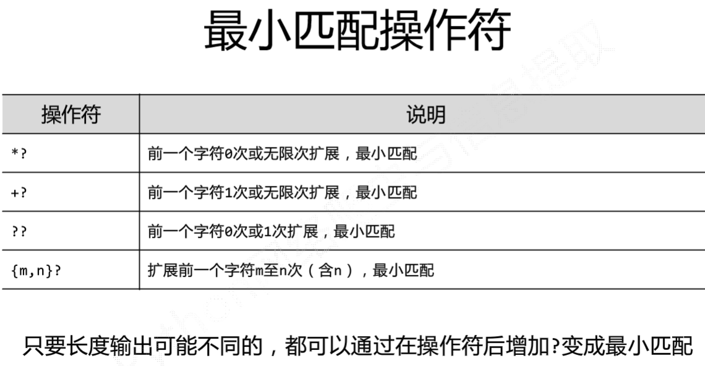

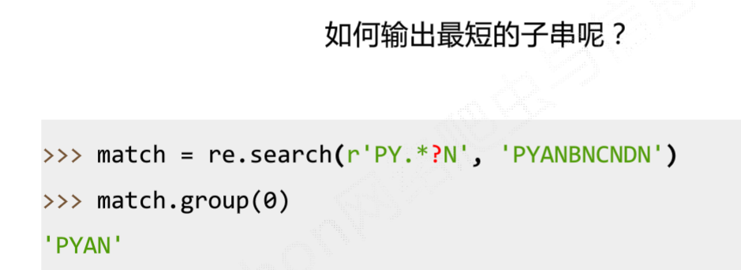